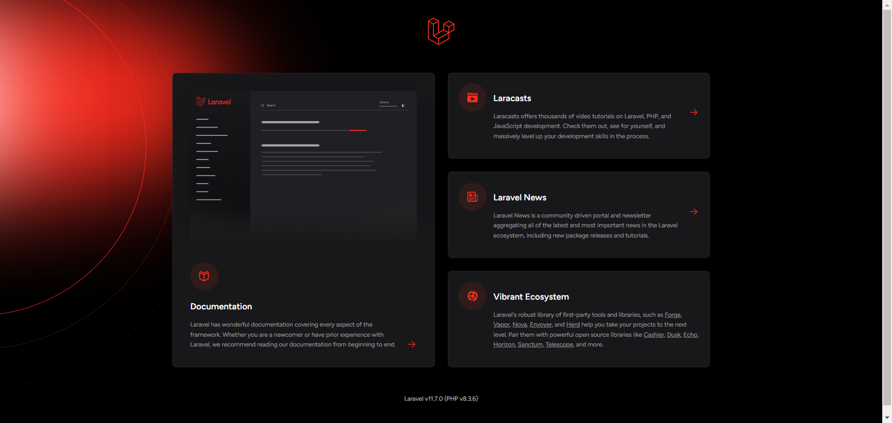

<!-- PROJECT LOGO -->
<br />
<div align="center">
  <p align="center"><a href="https://laravel.com" target="_blank"></a></p>

<h3 align="center">Laravel Source Setup</h3>

  <p align="center">
    Laravel is a web application framework with expressive, elegant syntax. I believe development must be an enjoyable and creative experience to be truly fulfilling.
    <br />
    <a href="https://laravel.com/docs/11.x"><strong>Explore the docs »</strong></a>
    <br />
  </p>
</div>


<!-- TABLE OF CONTENTS -->
<details>
  <summary>Table of Contents</summary>
  <ol>
    <li>
      <a href="#about-the-project">About The Project</a>
      <ul>
        <li><a href="#built-with">Built With</a></li>
      </ul>
    </li>
    <li>
      <a href="#getting-started">Getting Started</a>
      <ul>
        <li><a href="#installation">Installation</a></li>
      </ul>
    </li>
    <li><a href="#contributing">Contributing</a></li>
    <li><a href="#license">License</a></li>
    <li><a href="#contact">Contact</a></li>
  </ol>
</details>


<!-- ABOUT THE PROJECT -->
## About The Project



This project is a RESTful API built with Laravel, utilizing Redis for caching and MySQL for data storage. It demonstrates how to create a scalable and performant backend API using Laravel framework while integrating Redis for caching to improve response times.

## Features
Laravel Framework: A PHP framework for building web applications with expressive syntax and conventions.

Redis: An open-source, in-memory data structure store, used as a cache to improve the performance of API responses.

MySQL: A popular relational database management system used for storing and retrieving data.
<p align="right">(<a href="#readme-top">back to top</a>)</p>


### Built With

* [![Laravel][Laravel.com]][Laravel-url]
* [![Mysql.com]][Mysql-url]
* [![Redis.com]][Redis-url]
* [![Docker.com]][Docker-url]

<p align="right">(<a href="#readme-top">back to top</a>)</p>


<!-- GETTING STARTED -->
## Getting Started
Before you begin, ensure you have  a docker to run the application successfully or you will have the following installed:

PHP (https://www.php.net/) (php8.3)

Composer (https://getcomposer.org/)

MySQL (https://www.mysql.com/)

Redis (https://redis.io/)


### Installation

1. Clone the repo
```sh
git clone https://github.com/carterphangos/laravel_source_setup.git
cd laravel_source_setup
```
2. Set up environment variables
    
Copy the .env.example file to .env:

```sh
cp .env.example .env
```

Update the database and Redis configurations in the .env file with your local settings:

```sh
DB_CONNECTION=mysql
DB_HOST=127.0.0.1 || host.docker.internal
DB_PORT=3306
DB_DATABASE=your_database_name
DB_USERNAME=your_database_username
DB_PASSWORD=your_database_password

REDIS_HOST=127.0.0.1 || host.docker.internal
REDIS_PASSWORD=null
REDIS_PORT=6379
```

3. Run the following command
```sh
docker-compose up -d --build
```

<p align="right">(<a href="#readme-top">back to top</a>)</p>


<!-- USAGE EXAMPLES -->
## USAGE

Use the provided API endpoints to perform CRUD operations on your data.

Utilize Redis caching to improve the performance of frequently accessed data.

Customize and extend the API as needed for your project requirements.


<!-- CONTRIBUTING -->
## Contributing

Contributions are what make the open source community such an amazing place to learn, inspire, and create. Any contributions you make are **greatly appreciated**.

If you have a suggestion that would make this better, please fork the repo and create a pull request. You can also simply open an issue with the tag "enhancement".
Don't forget to give the project a star! Thanks again!

1. Fork the Project
2. Create your Feature Branch (`git checkout -b feature/AmazingFeature`)
3. Commit your Changes (`git commit -m 'Add some AmazingFeature'`)
4. Push to the Branch (`git push origin feature/AmazingFeature`)
5. Open a Pull Request

<p align="right">(<a href="#readme-top">back to top</a>)</p>


<!-- LICENSE -->
## License

Distributed under the MIT License. See `LICENSE.txt` for more information.

<p align="right">(<a href="#readme-top">back to top</a>)</p>


<!-- CONTACT -->
## Contact

Carter Phan - [@gmail]() - carter.phan.gos@gmail.com

Project Link: [https://github.com/carterphangos/laravel_source_setup](https://github.com/carterphangos/laravel_source_setup)

<p align="right">(<a href="#readme-top">back to top</a>)</p>

<!-- MARKDOWN LINKS & IMAGES -->
<!-- https://www.markdownguide.org/basic-syntax/#reference-style-links -->
[contributors-shield]: https://img.shields.io/github/contributors/github_username/repo_name.svg?style=for-the-badge
[contributors-url]: https://github.com/github_username/repo_name/graphs/contributors
[forks-shield]: https://img.shields.io/github/forks/github_username/repo_name.svg?style=for-the-badge
[forks-url]: https://github.com/github_username/repo_name/network/members
[stars-shield]: https://img.shields.io/github/stars/github_username/repo_name.svg?style=for-the-badge
[stars-url]: https://github.com/github_username/repo_name/stargazers
[issues-shield]: https://img.shields.io/github/issues/github_username/repo_name.svg?style=for-the-badge
[issues-url]: https://github.com/github_username/repo_name/issues
[license-shield]: https://img.shields.io/github/license/github_username/repo_name.svg?style=for-the-badge
[license-url]: https://github.com/github_username/repo_name/blob/master/LICENSE.txt
[linkedin-shield]: https://img.shields.io/badge/-LinkedIn-black.svg?style=for-the-badge&logo=linkedin&colorB=555
[linkedin-url]: https://linkedin.com/in/linkedin_username
[product-screenshot]: images/screenshot.png
[Next.js]: https://img.shields.io/badge/next.js-000000?style=for-the-badge&logo=nextdotjs&logoColor=white
[Next-url]: https://nextjs.org/
[React.js]: https://img.shields.io/badge/React-20232A?style=for-the-badge&logo=react&logoColor=61DAFB
[React-url]: https://reactjs.org/
[Vue.js]: https://img.shields.io/badge/Vue.js-35495E?style=for-the-badge&logo=vuedotjs&logoColor=4FC08D
[Vue-url]: https://vuejs.org/
[Angular.io]: https://img.shields.io/badge/Angular-DD0031?style=for-the-badge&logo=angular&logoColor=white
[Angular-url]: https://angular.io/
[Svelte.dev]: https://img.shields.io/badge/Svelte-4A4A55?style=for-the-badge&logo=svelte&logoColor=FF3E00
[Svelte-url]: https://svelte.dev/
[Laravel.com]: https://img.shields.io/badge/Laravel-FF2D20?style=for-the-badge&logo=laravel&logoColor=white
[Laravel-url]: https://laravel.com
[Bootstrap.com]: https://img.shields.io/badge/Bootstrap-563D7C?style=for-the-badge&logo=bootstrap&logoColor=white
[Bootstrap-url]: https://getbootstrap.com
[JQuery.com]: https://img.shields.io/badge/jQuery-0769AD?style=for-the-badge&logo=jquery&logoColor=white
[JQuery-url]: https://jquery.com 
[Redis.com]: https://img.shields.io/badge/redis-%23DD0031.svg?&style=for-the-badge&logo=redis&logoColor=white
[Redis-url]: https://redis.io/docs
[MySql.com]: https://img.shields.io/badge/MySQL-005C84?style=for-the-badge&logo=mysql&logoColor=white
[MySql-url]: https://dev.mysql.com/doc/
[Docker.com]:https://img.shields.io/badge/Docker-2CA5E0?style=for-the-badge&logo=docker&logoColor=white
[Docker-url]: https://docs.docker.com/
